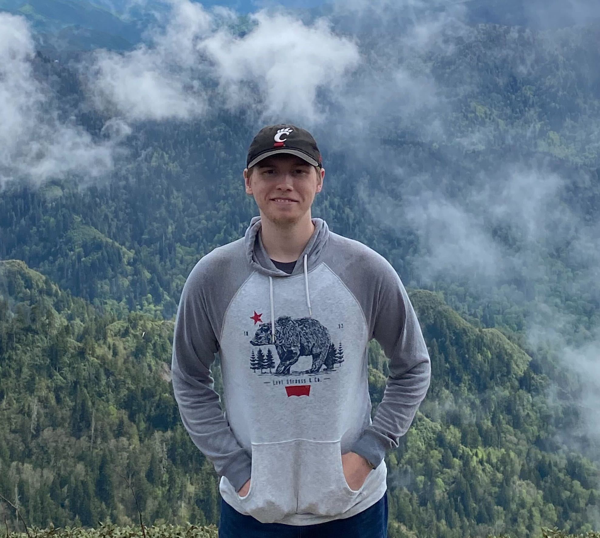
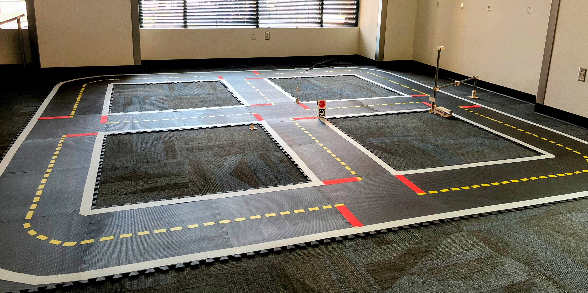
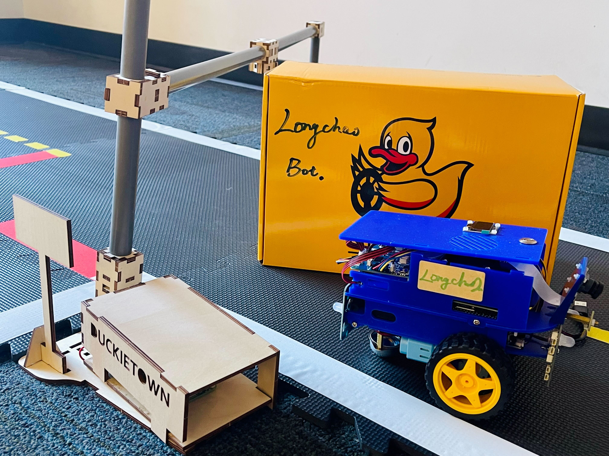
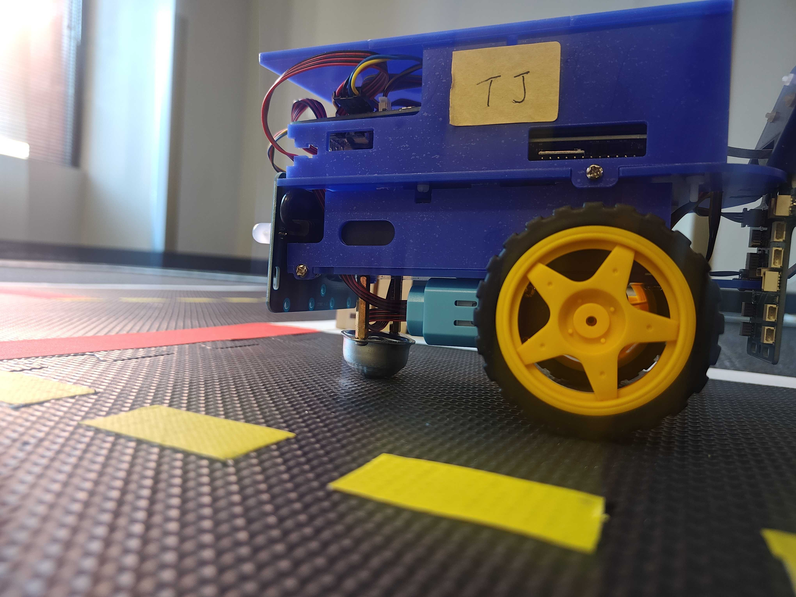
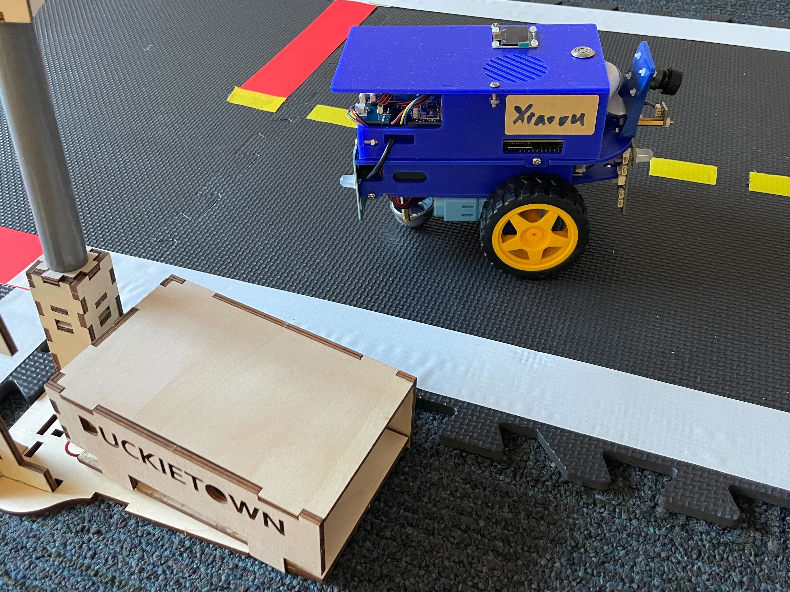
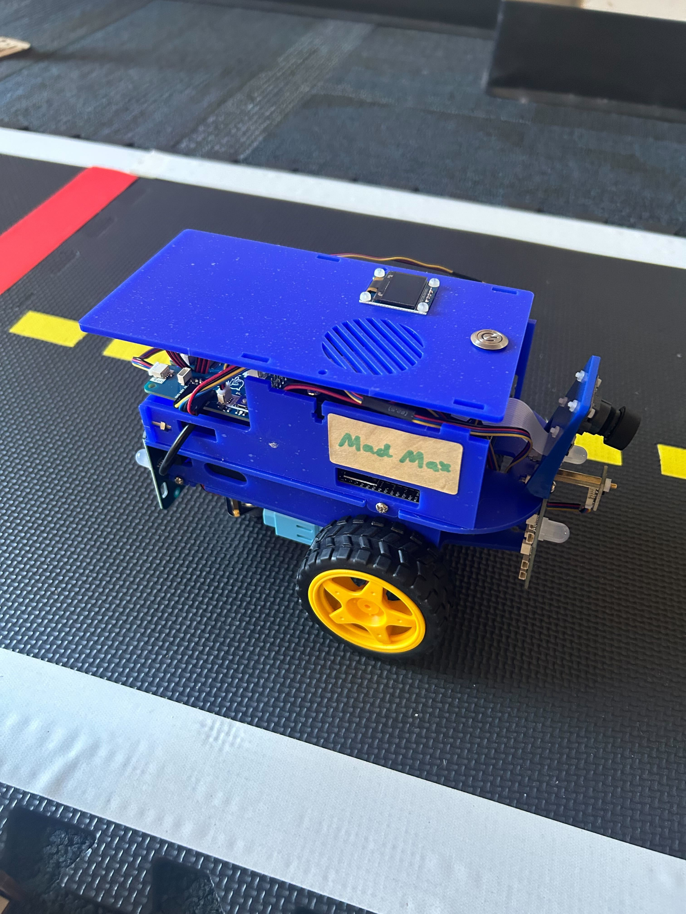

# 👋 Meet the Team!


**GitBook tip:** an employee directory can be a great way to help new folks get familiar with everyone they're going to be working with.


## [Hua Wei](https://www.public.asu.edu/~hwei27/)

👋 PI —  :rainbow: hua.wei@asu.edu — 🇺🇸 Phoenix (GMT-7)

### Bio

Hua Wei (him/his) is an assistant professor at the School of Computing and Augmented Intelligence (SCAI) in [Arizona State University (ASU)](https://www.asu.edu/).&#x20;

Before joining ASU, he worked as an Assistant Professor at the New Jersey Institute of Technology and as a Staff Researcher at Tencent AI Lab. He got his Ph.D. from Pennsylvania State University in 2020 under the supervision of Dr. [Zhenhui (Jessie) Li](https://faculty.ist.psu.edu/jessieli/Site/index.html). Before that, he received his master's and bachelor's degrees from Beihang University (BUAA) majoring in Computer Science, working with Prof. [Jinpeng Huai](http://ev.buaa.edu.cn/info/1056/1346.htm) and Dr. [Tianyu Wo](https://dblp.uni-trier.de/pers/hd/w/Wo:Tianyu).


**GitBook tip:** Your bio could be your background, your research interest or your hobbies.


## [Longchao Da](https://longchaoda.github.io/)

👋 Ph.D student— 💌 longchao@asu.edu — 🇺🇸 Phoenix (GMT-7)

### Bio

I'm a CS Ph.D. student at Arizona State University, where I am under the guidance of Prof. Hua Wei. Prior to this, I served as a research assistant at the New Jersey Institute of Technology. My academic focus centers on the trustworthy LLMs, Reinforcement Learning and Data Mining, and I am deeply committed to exploring their real-world applications. Apart from my research pursuits, Music and Workout are my favorite!

## [Jiaxing Zhang](https://tabzhangjx.github.io/)

👋 Ph.D. student — 💌jz48@njit.edu — Currently 🇺🇸 Newark (GMT-4)

<figure><figcaption></figcaption></figure>

### Bio

I am a Ph.D. student at the New Jersey Institute of Technology. I obtained my bachelor's degree in computer science from Xi’an Jiaotong University in 2020. I’m currently doing my Ph.D. study, (co-)supervised by Prof. Hua Wei. My research focuses on data mining (Explainable AI), deep learning (LLM), and natural language processing (code analysis).

## [Tiejin Chen](https://tiejin98.github.io/)

👋 Ph.D. student — 💌tiejin@asu.edu— Currently 🇺🇸Phoenix (GMT-7)

<figure><figcaption></figcaption></figure>

### Bio

I am an CS Ph.D. student at Arizona State University, where I am supervised by Prof. Hua Wei. Prior to this, I obtained my bachelor's degree in statistics from Sichuan University in 2020 and my master's degree in applied statistics from the University of Michigan, Ann Arbor in 2023. My research interests lie in efficient machine learning and reinforcement learning.

## [Xiaoou Liu](https://xiao0o0o.github.io/)

👋 Ph.D. student — 💌xiaooulii@asu.edu— Currently 🇺🇸Phoenix (GMT-7)

<figure><figcaption></figcaption></figure>

### Bio

I am a first-year Ph.D. student in Computer Science at Arizona State University (ASU), working under the supervision of Professor Hua Wei. Previously, I obtained my Bachelor's degree from Beijing Jiaotong University and my Master's degree from the University of British Columbia (UBC), Okanagan Campus, under the guidance of Professor [Yong Gao](https://cmps-people.ok.ubc.ca/yongg/). My current interests lie in the Trustworthy Graph Neural Networks and various graph-based applications. If you have similar research interests, I’d be happy to connect and discuss ideas!

## [Justin Turnau](https://justinturnau.github.io/)

👋 Ph.D. student — 💌jturnau@asu.edu— Currently 🇺🇸Phoenix (GMT-7)

<figure><figcaption></figcaption></figure>

### Bio

I am a first-year PhD student at Arizona State University, working under the mentorship of Dr. Hua Wei. I earned my bachelor's degree in computer science from the University of Cincinnati. My research focuses on Reinforcement Learning, with a particular emphasis on Multi-Agent Reinforcement Learning. Outside of my academic pursuits, I enjoy playing board games and video games, as well as listening to music!

## Robots

| Profile                                                                                             | Name        | Parent                      |
| --------------------------------------------------------------------------------------------------- | ----------- | --------------------------- |
|  | Darl Track  | Longchao Da and Tiejin Chen |
|                              | Longchao    | Longchao Da                 |
|                   | TJ          | Tiejin Chen                 |
|                              | Xiaoou      | Xiaoou Liu                  |
|                              | Mad Max     | Justin Turnau               |
|                             | Chicinvabot | Albert Vo                   |

### Alumni

\[list of alumni here; this is kept updated on [Hua's website](https://www.public.asu.edu/~hwei27/people.html)]
